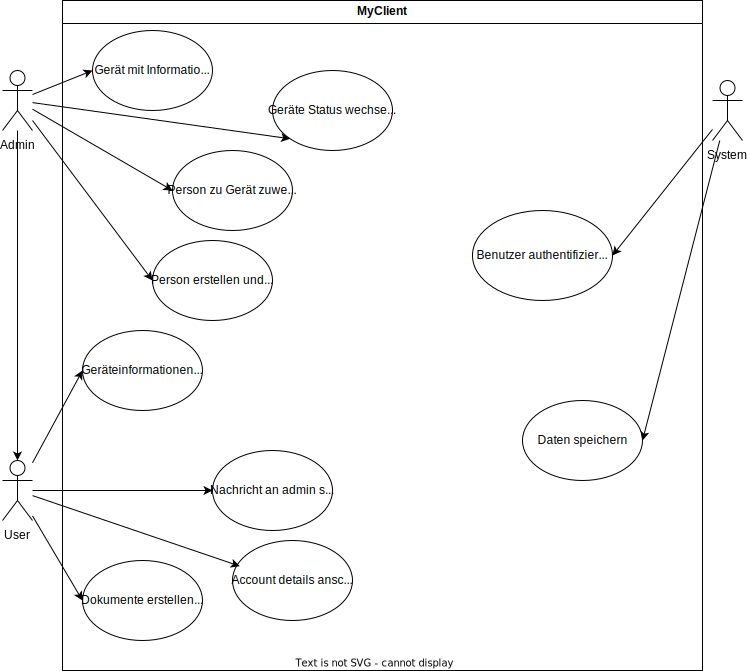
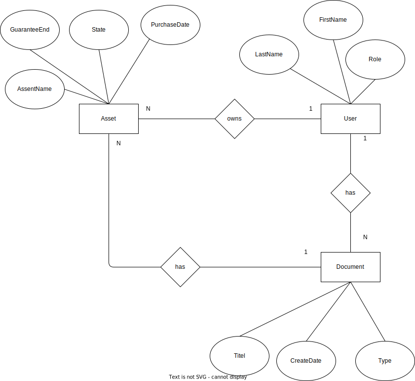
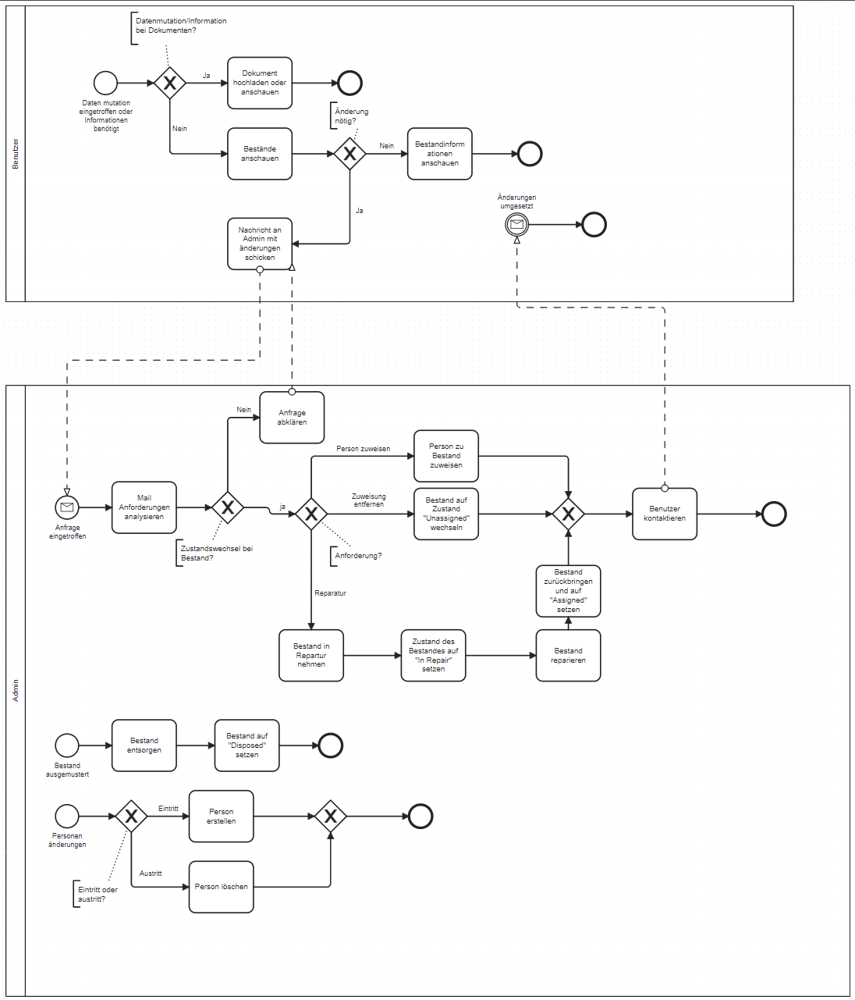

| Titel | Gerät mit Informationen erstellen |
|:----------|:----------|
| Actors   | Admin  | 
| Eintrittsbedingungen  | Dieser UseCase beginnt wenn ein neues Gerät in den Bestand aufgenommen wird.    | 
| Ereignissequenz  | Admin loggt sich mit dem admin Account ein, navigiert zu MyAssets, Füllt die Daten bei "Create Asset" ein, drückt auf submit.  | 
| Austrittsbedingung | Der Bestand ist in der Liste korrekt aufgenommen. |
| Ausnahme | Die nötigen Felder sind nicht ausgefüllt und müssen ausgefüllt werden. |
| Daten | AssetName, PurchaseDate, GuaranteeEnd |

| Titel | Geräte Status wechseln |
|:----------|:----------|
| Actors   | Admin, Benutzer   | 
| Eintrittsbedingungen  | UseCase beginnt wenn ein Benutzer eine Anfrage schickt, die zur Zustandsänderung führt.   | 
| Ereignissequenz  | Admin loggt sich mit admin Account ein, navigiert zu "MyAssets", wählt beim betroffenen Bestand den gewünschten Zustand aus. | 
| Austrittsbedingung | Bestand hat den korrekten Zustand |
| Ausnahme | Bestand muss korrigiert werden. |
| Besondere Anforderungen | Bestand muss eventuell zuerst in einen anderen Zustand versetzt werden, um korrekten Zustand einzunehmen. |
| Daten | Personen Email, AssetName, AssetState |

| Titel |  Person zu Gerät zuweisen |
|:----------|:----------|
| Actors   | Admin, benutzer  | 
| Eintrittsbedingungen  | Dieser UseCase startet, wenn ein Benutzer eine Anfrage zur Zuweisung eines Geräts zu einer Person anfrägt.   | 
| Ereignissequenz  | Benutzer schickt eine Nachricht per Mail an den Admin, Admin wählt auf der "MyAssets" Seite den gewünschten Bestand und wählt die betroffene Email der Person aus, Durch den "Assign" knopf wird es zugewiesen.   | 
| Austrittsbedingung | Bestand ist korrekt zugewiesen |
| Ausnahme | Bestand oder Person muss kontrolliert werden. |
| Besondere Anforderungen | Daten müssen vorhanden sein. |
| Daten | PersonenEmail, AssetName, AssetState |

| Titel |  Person erstellen und löschen |
|:----------|:----------|
| Actors   | Admin   | 
| Eintrittsbedingungen  | Dieser UseCase beginnt wenn eine neue Person eintritt oder eine Person austritt.   | 
| Ereignissequenz  | Admin navigiert zu "MyPersons", bei eintritt erstellt über CreatePerson eine neue Person mit korrekten Daten, bei Austritt wird die betroffene Person mittels Delete knopf gelöscht.   | 
| Austrittsbedingung | Neue Person ist korrekt angelegt, bei Austritt ist die Person nicht mehr vorhanden. |
| Ausnahme | Daten kontrolle |
| Daten | FirstName, LastName, Email  |

| Titel |  Geräteinformationen anschauen |
|:----------|:----------|
| Actors   | Benutzer, Admin   | 
| Eintrittsbedingungen  | Benutzer oder Admin brauchen informationen eines Bestandes   | 
| Ereignissequenz  | Mit Account einloggen, zu "MyAssets" Seite navigieren  | 
| Austrittsbedingung | Sobald nötige Informationen ersichtlich sind. |
| Ausnahme | Daten verifizieren |
| Daten | AssetName, PurchaseDate, GuaranteeEnd, AssetState, PersonEmail |

| Titel | Nachricht an admin schicken |
|:----------|:----------|
| Actors   | Benutezr  | 
| Eintrittsbedingungen  | Benutezr hat ein Anliegen bezüglich eines Bestandes | 
| Ereignissequenz  | Der eingeloggte Benutzer navigiert zu "MyAssets", öffnet Leiste zur Nachrichten eingabe, verfasst eine Nachricht, mit dem senden knopf schickt es die Nachricht an die Admin mail  | 
| Austrittsbedingung | Nachricht wurde erfolgreich gesendet |
| Ausnahme | Nachricht kontrollieren |
| Daten | To, Message, Subject |

| Titel |  Account details anschauen |
|:----------|:----------|
| Actors   | Admin, Benutzer  | 
| Eintrittsbedingungen  | Benutzer oder Admin braucht informationen zum eigenen Account  | 
| Ereignissequenz  | Mit eingeloggtem Benutzer zu "MyAccount" navigieren, Account Informationen erhalten.   | 
| Austrittsbedingung | gewünschte Informationen zum Account werden angezeigt |
| Ausnahme | Account ist fehlerhaft |
| Besondere Anforderungen | Muss ein authentifizierter Account sein |
| Daten | FirstName, LastName, Email, Role |

| Titel | Dokumente erstellen und informationen anschauen |
|:----------|:----------|
| Actors   | Admin, benutzer   | 
| Eintrittsbedingungen  | Dieser UseCase beginnt, wenn Benutzer oder Admin Dokumente erstellen oder Dokumenteninformationen brauchen   | 
| Ereignissequenz  | Mit Account eingeloogt zu "MyDocuments" navigieren, Dokument Hochladen oder Dokument anschauen.  | 
| Austrittsbedingung | Dokument ist hochgeladen oder benötigte Informationen sind vorhanden. |
| Ausnahme | Admin kontaktieren |
| Daten | DocTitle, UploadDate, personEmail  |

| Titel |  Benutzer authentifizieren |
|:----------|:----------|
| Actors   | System  | 
| Eintrittsbedingungen  | Benutzer oder Admin möchte ins System einloggen   | 
| Ereignissequenz  | Auf der Webseite werden die Logindaten eingegeben  | 
| Austrittsbedingung | Login ist korrekt und Benutzer wird angemeldet oder es ist falsch und wird nicht angemeldet. |
| Ausnahme | Bei falschem Verhalten muss Admin kontaktiert werden und API zu auth0 kontrolliert werden |
| Besondere Anforderungen | API zu auth0 |
| Daten | Email, Passwort |

| Titel |  Daten speichern |
|:----------|:----------|
| Actors   | System   | 
| Eintrittsbedingungen  | Wenn Benutzer oder Admin veränderungen an Daten tätigen   | 
| Ereignissequenz  | Benutzer oder Admin sind eingeloggt, neues Dokument wird erstellt oder Bestandsinformationen werden verändert  | 
| Austrittsbedingung | Daten sind korrekt gespeichert |
| Ausnahme | Daten sind korrupt |
| Daten | DocTitle, UploadDate, AssetName, PurchaseDate, GuaranteeEnd, AssetState, PersonEmail, FirstName, LastName, Email |

