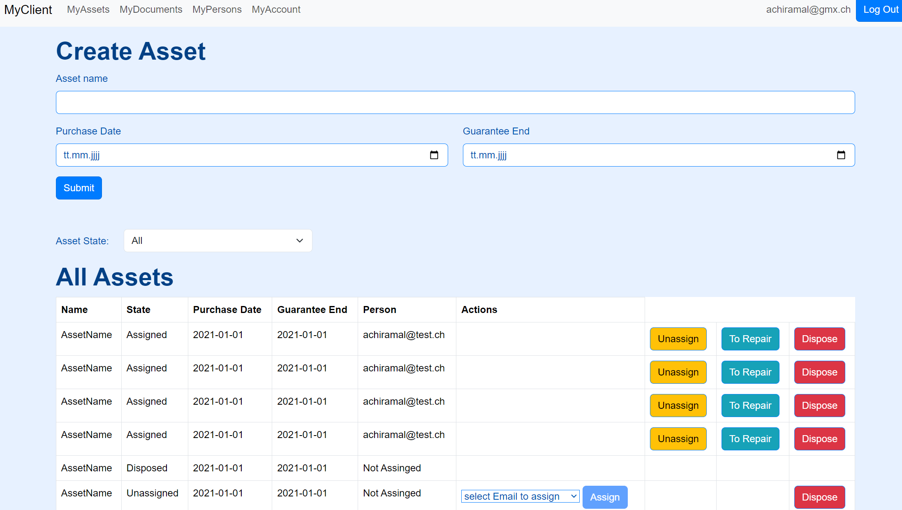
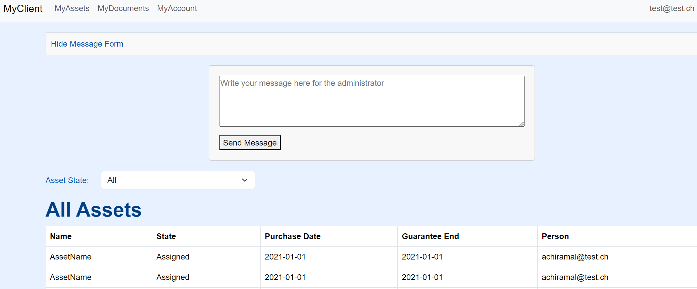
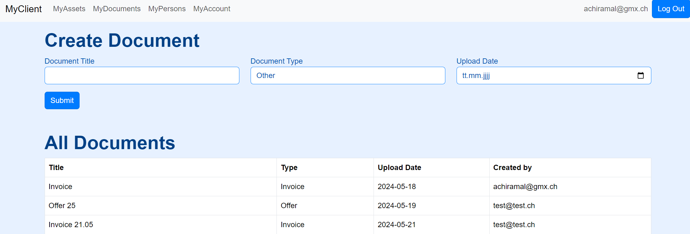
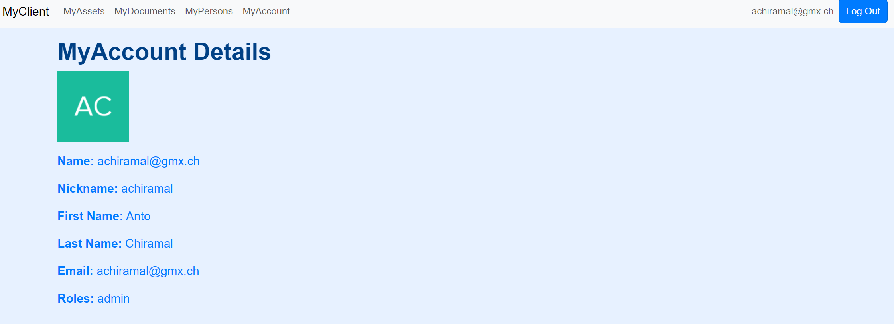
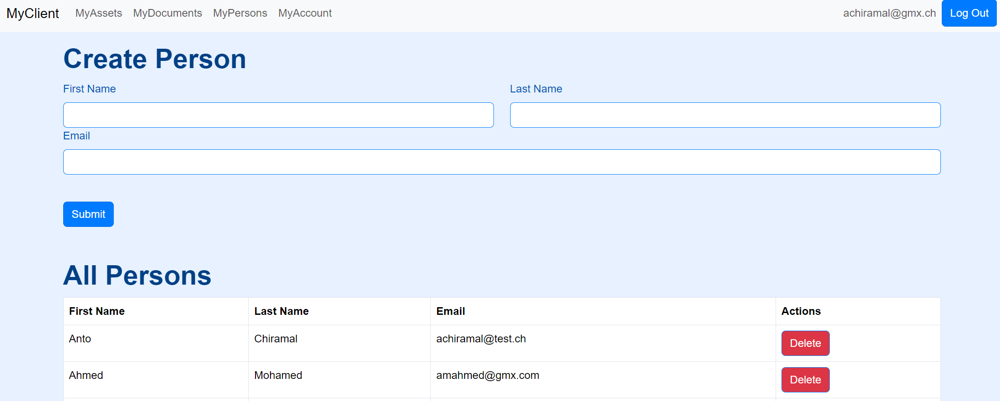

# Klassendiagramm

# Klassendiagramm Erläuterung

## AssetController
- **Verwendungszweck**: Diese Klasse ist ein REST-Controller, der CRUD-Operationen und Statusänderungen für Assets verwaltet. Sie enthält Endpunkte zum Erstellen, Abrufen, Zuweisen, Reparieren und Entsorgen von Assets.

## DocController
- **Verwendungszweck**: Diese Klasse ist ein REST-Controller, der CRUD-Operationen und Typänderungen für Dokumente verwaltet. Sie enthält Endpunkte zum Erstellen und Abrufen von Dokumenten sowie zum Ändern des Dokumenttyps.

## MailController
- **Verwendungszweck**: Diese Klasse ist ein REST-Controller, der das Versenden von E-Mails verwaltet. Sie enthält Endpunkte zum Versenden von E-Mails an Benutzer.

## PersonController
- **Verwendungszweck**: Diese Klasse ist ein REST-Controller, der CRUD-Operationen für Personen verwaltet. Sie enthält Endpunkte zum Erstellen und Abrufen von Personendaten.

## ServiceController
- **Verwendungszweck**: Diese Klasse ist ein REST-Controller, der spezielle Service-Operationen für Assets verwaltet. Sie enthält Endpunkte zum Zuweisen und Ändern des Zustands von Assets.

## Asset
- **Verwendungszweck**: Diese Klasse repräsentiert das Modell eines Assets. Sie enthält Attribute wie `id`, `assetName`, `purchaseDate`, `guaranteeEnd`, `assetState`, `personId` und `personEmail`. Sie wird verwendet, um die Eigenschaften und Zustände eines Assets zu verwalten.

## Doc
- **Verwendungszweck**: Diese Klasse repräsentiert das Modell eines Dokuments. Sie enthält Attribute wie `id`, `docTitle`, `uploadDate`, `docType` und `userEmail`. Sie wird verwendet, um die Eigenschaften und Metadaten eines Dokuments zu verwalten.

## Mail
- **Verwendungszweck**: Diese Klasse repräsentiert das Modell einer E-Mail. Sie enthält Attribute wie `to`, `subject` und `message`. Sie wird verwendet, um die Details einer E-Mail-Nachricht zu verwalten.

## Person
- **Verwendungszweck**: Diese Klasse repräsentiert das Modell einer Person. Sie enthält Attribute wie `id`, `firstName`, `lastName` und `email`. Sie wird verwendet, um die persönlichen Informationen eines Benutzers zu verwalten.

## AssetCreateDTO
- **Verwendungszweck**: Diese Data Transfer Object (DTO)-Klasse wird verwendet, um Daten beim Erstellen eines neuen Assets zu übertragen. Sie enthält Attribute wie `assetName`, `purchaseDate`, `guaranteeEnd` und `assetState`.

## DocCreateDTO
- **Verwendungszweck**: Diese Data Transfer Object (DTO)-Klasse wird verwendet, um Daten beim Erstellen eines neuen Dokuments zu übertragen. Sie enthält Attribute wie `docTitle`, `uploadDate`, `docType` und `userEmail`.

## AssetStateChangeDTO
- **Verwendungszweck**: Diese Data Transfer Object (DTO)-Klasse wird verwendet, um Daten beim Ändern des Zustands eines Assets zu übertragen. Sie enthält Attribute wie `personEmail` und `assetId`.

## DocTypeChangeDTO
- **Verwendungszweck**: Diese Data Transfer Object (DTO)-Klasse wird verwendet, um Daten beim Ändern des Typs eines Dokuments zu übertragen. Sie enthält Attribute wie `newType`.

## MailInformation
- **Verwendungszweck**: Diese Klasse enthält zusätzliche Informationen, die beim Versenden von E-Mails verwendet werden. Sie ergänzt das `Mail`-Modell mit weiteren Details.

## AssetRepository
- **Verwendungszweck**: Diese Schnittstelle erweitert `JpaRepository` und bietet CRUD-Operationen für das `Asset`-Modell. Sie wird verwendet, um Assets in der Datenbank zu verwalten.

## DocRepository
- **Verwendungszweck**: Diese Schnittstelle erweitert `JpaRepository` und bietet CRUD-Operationen für das `Doc`-Modell. Sie wird verwendet, um Dokumente in der Datenbank zu verwalten.

## PersonRepository
- **Verwendungszweck**: Diese Schnittstelle erweitert `JpaRepository` und bietet CRUD-Operationen für das `Person`-Modell. Sie wird verwendet, um Personen in der Datenbank zu verwalten.

## SecurityConfig
- **Verwendungszweck**: Diese Klasse konfiguriert die Sicherheitseinstellungen der Anwendung. Sie definiert Sicherheitsregeln und Authentifizierungsmechanismen.

## MailService
- **Verwendungszweck**: Diese Klasse bietet Methoden zum Versenden von E-Mails. Sie verwendet `JavaMailSender`, um E-Mails basierend auf den angegebenen Details zu senden.

## DocService
- **Verwendungszweck**: Diese Klasse bietet Methoden zur Verwaltung von Dokumenten. Sie enthält Logik zum Aktualisieren des Dokumenttyps und zur Interaktion mit dem `DocRepository`.

## AssetService
- **Verwendungszweck**: Diese Klasse bietet Methoden zur Verwaltung von Assets. Sie enthält Logik zum Erstellen, Aktualisieren und Löschen von Assets sowie zur Interaktion mit dem `AssetRepository`.

## ServiceUtils
- **Verwendungszweck**: Diese Klasse bietet Hilfsfunktionen, die von verschiedenen Services verwendet werden. Sie enthält allgemeine Methoden, die in der gesamten Anwendung nützlich sind.

## MailValidatorService
- **Verwendungszweck**: Diese Klasse bietet Validierungslogik für E-Mails. Sie stellt sicher, dass die E-Mail-Daten korrekt sind, bevor sie gesendet werden.

## Frontend Beschreibung und Screenshots

## My Assets Page
Die My Assets-Seite ermöglicht die Verwaltung und Anzeige von Assets. Die Seite besteht aus folgenden Komponenten:

- **Navigation Bar**: Beinhaltet Links zu verschiedenen Bereichen der Applikation (MyAssets, MyDocuments, MyPersons, MyAccount) und den Logout-Button.
- **Asset Management Section**: Zeigt eine Tabelle aller Assets und ermöglicht das Hinzufügen, Zuweisen, Reparieren, Unassignen und Entsorgen von Assets.

### Benutzerrollen

- **Admin**: Kann Assets erstellen, zuweisen, unassignen, zur Reparatur schicken und entsorgen.
- **Nicht-Admin**: Kann Nachrichten an den Administrator senden.

### Funktionen

- **Asset Filter**: Ermöglicht das Filtern der Assets nach Status (Assigned, Unassigned, In Repair, Disposed).
- **Pagination**: Zeigt Assets seitenweise an.

## MyDocuments

Die My Documents-Seite ermöglicht die Verwaltung und Anzeige von Dokumenten. Die Seite besteht aus folgenden Komponenten:

- **Navigation Bar**: Beinhaltet Links zu verschiedenen Bereichen der Applikation (MyAssets, MyDocuments, MyPersons, MyAccount) und den Logout-Button.
- **Document Management Section**: Zeigt eine Tabelle aller Dokumente und ermöglicht das Hinzufügen und Aktualisieren von Dokumenten.

### Funktionen

- **Dokumentenfilter**: Ermöglicht das Filtern der Dokumente nach Typ.
- **Dokumentenerstellung**: Ermöglicht das Erstellen neuer Dokumente durch Eingabe von Titel, Hochladedatum und Dokumenttyp.
- **Dokumentenaktualisierung**: Ermöglicht das Aktualisieren des Dokumententyps.

## MyAccount Page
Die MyAccount-Seite zeigt die Kontoinformationen des aktuell angemeldeten Benutzers. Die Seite besteht aus folgenden Komponenten:

- **Navigation Bar**: Beinhaltet Links zu verschiedenen Bereichen der Applikation (MyAssets, MyDocuments, MyPersons, MyAccount) und den Logout-Button.
- **Account Details Section**: Zeigt die persönlichen Informationen des Benutzers, wie Vorname, Nachname, E-Mail-Adresse und weitere Details.
- **Benutzerinformationen**:
  - **Profilbild**: Zeigt das Profilbild des Benutzers.
  - **Name**: Zeigt den vollständigen Namen des Benutzers.
  - **Nickname**: Zeigt den Spitznamen des Benutzers.
  - **Vorname**: Zeigt den Vornamen des Benutzers.
  - **Nachname**: Zeigt den Nachnamen des Benutzers.
  - **E-Mail**: Zeigt die E-Mail-Adresse des Benutzers.
  - **Rollen**: Zeigt die Rollen des Benutzers an, falls vorhanden.

Die Seite verwendet die Authentifizierungsinformationen aus dem `user`-Store, um die Benutzerinformationen anzuzeigen. Wenn der Benutzer nicht angemeldet ist, wird eine Meldung "Not logged in" angezeigt.

## MyPersons

Die MyPersons-Seite ermöglicht die Verwaltung und Anzeige von Personen. Die Seite besteht aus folgenden Komponenten:

- **Navigation Bar**: Beinhaltet Links zu verschiedenen Bereichen der Applikation (MyAssets, MyDocuments, MyPersons, MyAccount) und den Logout-Button.
- **Person Management Section**: Zeigt eine Tabelle aller Personen und ermöglicht das Hinzufügen und Löschen von Personen.

### Funktionen

- **Personenverwaltung**: Ermöglicht das Erstellen neuer Personen durch Eingabe von Vorname, Nachname und E-Mail-Adresse.
- **E-Mail-Validierung**: Validiert die E-Mail-Adresse, bevor eine neue Person erstellt wird.
- **Personenanzeige**: Zeigt eine Liste aller Personen an, die in der Anwendung registriert sind.
- **Personenlöschung**: Ermöglicht das Löschen einer Person aus der Liste (nur für Admin-Benutzer).

## Login
Die Login-Seite ermöglicht Benutzern, sich mit ihrem Benutzernamen und Passwort anzumelden. Die Seite besteht aus folgenden Komponenten:

- **Login-Formular**: Ein Formular, das den Benutzernamen und das Passwort des Benutzers erfordert, um sich anzumelden.
- **Authentifizierung**: Verwendet den Authentifizierungsdienst, um die Anmeldedaten zu überprüfen und den Benutzer anzumelden.

### Funktionen

- **Formularvalidierung**: Das Anmeldeformular verwendet Bootstrap zur Validierung der Eingabefelder.
- **Anmeldung**: Wenn die Anmeldedaten korrekt sind, wird der Benutzer angemeldet und zu einer geschützten Seite weitergeleitet.
- **Willkommensnachricht**: Nach erfolgreicher Anmeldung wird eine Willkommensnachricht angezeigt, die den Benutzernamen des Benutzers enthält.